# System Architecture

> Foundry is a deterministic, recoverable autonomous engineering runtime. This document is the authoritative architecture reference.

---

## Design Philosophy

Foundry operates on a single axiom: **users express engineering intent; the runtime handles everything else**.

A user says "build a REST API for user management." Foundry internally manages:
- Requirements extraction and specification
- Task decomposition into dependency-ordered plans
- Code generation via subagent orchestration
- Sequential validation through tool gates (lint → types → tests → security)
- Multi-round structured debate for quality review
- Retry escalation, replanning, and recovery on failure
- Checkpoint persistence for crash recovery
- Budget enforcement to prevent runaway execution

The user never sees orchestration, retries, consensus mechanics, or internal state management. They see workflows and outcomes.

### Architectural Principles

| Principle | Description | Enforcement |
|---|---|---|
| **Deterministic Transitions** | Same inputs → same phase flow | `PhaseGraph` FSM validates all transitions |
| **Validation-First** | Tool gates are authoritative — "looks correct" is never acceptable | `ToolGate` enforces lint→types→tests→coverage→security |
| **Checkpoint-Recoverable** | Every phase transition creates an atomic snapshot | `EnhancedCheckpointManager` with versioned chains |
| **Budget-Bounded** | Token/time/retry budgets are hard ceilings, never advisory | `BudgetController` with critical-severity violations |
| **Single Orchestrator** | One agent (Foundry) with internal behavioral modes, not a multi-agent swarm | `OrchestratorFSM` is the sole phase controller |
| **Reasoning is Orchestration** | Debate, judging, confidence are orchestration internals, not a separate layer | All reasoning modules live under `engine/` |
| **Tool Gateway Abstraction** | No module directly calls an MCP — always route through the gateway | `tool_executor → MCP → validate_output` |
| **Disk is Truth** | State manager is canonical; memory/runtime state derives from persistent files | `StateManager` writes atomically via tmp+rename |

---

## System Layers

```
┌───────────────────────────────────────────────────────────────────┐
│  USER LAYER                                                       │
│  Capabilities: build, debug, review, test, refactor, architect    │
│  Entry: Natural language intent → SDLC task creation              │
└───────────────────────────┬───────────────────────────────────────┘
                            │
┌───────────────────────────▼───────────────────────────────────────┐
│  ORCHESTRATION LAYER                                              │
│  ┌──────────────┐ ┌────────────┐ ┌───────────┐ ┌──────────────┐  │
│  │ OrchestratorFSM│ │ Planner    │ │ Replanner │ │ BudgetCtrl   │  │
│  │ (phase_graph) │ │ (dep_graph)│ │ (recovery)│ │ (enforcement)│  │
│  └──────────────┘ └────────────┘ └───────────┘ └──────────────┘  │
│  ┌──────────────┐ ┌────────────┐ ┌───────────┐ ┌──────────────┐  │
│  │ DebateEngine │ │ JudgeSystem│ │ Confidence│ │ RetryPolicy  │  │
│  │ (consensus)  │ │ (hierarchy)│ │ (gating)  │ │ (escalation) │  │
│  └──────────────┘ └────────────┘ └───────────┘ └──────────────┘  │
└───────────────────────────┬───────────────────────────────────────┘
                            │
┌───────────────────────────▼───────────────────────────────────────┐
│  EXECUTION LAYER                                                  │
│  ┌──────────────┐ ┌────────────┐ ┌───────────┐                   │
│  │ MCP Server   │ │ ToolGate   │ │ ToolExec  │                   │
│  │ (app.py)     │ │ (gates)    │ │ (timeout) │                   │
│  └──────────────┘ └────────────┘ └───────────┘                   │
│  ┌──────────────┐ ┌────────────┐                                  │
│  │ ExecRuntime  │ │ Validators │                                  │
│  │ (determinism)│ │ (schema)   │                                  │
│  └──────────────┘ └────────────┘                                  │
└───────────────────────────┬───────────────────────────────────────┘
                            │
┌───────────────────────────▼───────────────────────────────────────┐
│  STATE & MEMORY (Cross-cutting)                                   │
│  ┌──────────────┐ ┌────────────┐ ┌───────────┐ ┌──────────────┐  │
│  │ StateManager │ │ MemoryStore│ │ Checkpoint│ │ Rollback     │  │
│  │ (disk truth) │ │ (retrieval)│ │ (versions)│ │ (git-safe)   │  │
│  └──────────────┘ └────────────┘ └───────────┘ └──────────────┘  │
└───────────────────────────┬───────────────────────────────────────┘
                            │
┌───────────────────────────▼───────────────────────────────────────┐
│  OBSERVABILITY (Cross-cutting)                                    │
│  ┌──────────────┐ ┌────────────┐                                  │
│  │ Tracer       │ │ Dashboard  │                                  │
│  │ (JSONL spans)│ │ (telemetry)│                                  │
│  └──────────────┘ └────────────┘                                  │
└───────────────────────────┬───────────────────────────────────────┘
                            │
┌───────────────────────────▼───────────────────────────────────────┐
│  TOOL GATEWAY → MCP LAYER                                        │
│  filesystem, shell, git, github, docker                           │
└───────────────────────────────────────────────────────────────────┘
```

---

## Data Flow: Complete Build Cycle

```
User: "build a REST API for user management"
  │
  ├─ sdlc_create_task(description, mode="feature")
  │   └─ Creates Task object, initializes budget, locks prompts
  │
  ├─ sdlc_get_next_action(task_id)
  │   └─ OrchestratorFSM determines: current_phase = "Chatting" → next = "Specs"
  │   └─ Returns: model routing, prompt template, required artifacts
  │
  ├─ [Host agent generates spec output via LLM]
  │
  ├─ sdlc_submit_output(task_id, "Specs", output)
  │   ├─ JudgeEngine evaluates output quality
  │   ├─ If judge passes:
  │   │   ├─ Write checkpoint
  │   │   └─ Transition: Specs → Planning
  │   └─ If judge fails:
  │       ├─ Increment iteration_count
  │       ├─ Check budget (max_review_cycles, max_runtime_minutes)
  │       └─ Return rejection with specific issues
  │
  ├─ [Repeat get_next_action → generate → submit for each phase]
  │
  ├─ At "Review" phase:
  │   ├─ DebateRuntime runs 3-round protocol
  │   │   ├─ Round 1: Independent assessment (specs, coding, testing reviewers)
  │   │   ├─ Round 2: Deliberation (agents see each other's Round 1 responses)
  │   │   └─ Round 3: Final positions
  │   ├─ ConsensusEngine evaluates:
  │   │   ├─ Agent verdicts
  │   │   ├─ Minority reports
  │   │   ├─ Sycophantic collapse detection
  │   │   └─ Residual objections
  │   └─ ConfidenceGate enforces threshold
  │
  └─ Phase "Done":
      ├─ Completion report generated
      ├─ Final checkpoint saved (marked stable)
      └─ Task status → "done"
```

---

## Module Dependency Graph

```mermaid
graph TD
    A["app.py (MCP Server)"] --> B["OrchestratorFSM"]
    A --> C["ExecutionPolicy"]
    A --> D["JudgeEngine"]
    A --> E["DebateRuntime"]
    A --> F["Tracer"]
    A --> G["SqliteStore"]
    A --> H["CheckpointManager"]
    A --> I["WriteQueue"]
    A --> J["IndexPipeline"]
    
    B --> K["PhaseGraph"]
    B --> C
    
    E --> L["ConsensusEngine"]
    E --> F
    
    D --> M["LLMProvider"]
    E --> M
    L --> M
    
    I --> G
    I --> H
    
    N["StateManager"] --> O["Atomic JSON files"]
    P["MemoryStore"] --> Q["Acervo"]
    R["EnhancedCheckpointManager"] --> S["Versioned JSON chains"]
    T["BudgetController"] --> U["BudgetPolicy"]
    V["RetryPolicy"] --> W["FailureClassification"]
    X["Replanner"] --> Y["Stable-phase preservation"]
    Z["RollbackManager"] --> AA["Git coordination"]
    AB["ToolGate"] --> AC["Gate sequence enforcement"]
    AD["ConfidenceGate"] --> AE["Vote normalization"]
    AF["ExecutionRuntime"] --> AG["Prompt hash locking"]
```



---

## Subsystem Boundaries

Each subsystem has a strict responsibility boundary. No subsystem may reach into another's internals.

| Subsystem | Owns | Never Touches |
|---|---|---|
| **OrchestratorFSM** | Phase transitions, execution ordering | Budget logic, retry logic, failure classification |
| **ExecutionPolicy** | Budget decisions, failure classification, retry decisions | Phase transitions, consensus |
| **DebateRuntime** | 3-round protocol, agent calls, partial completion | Filesystem, external state, consensus logic |
| **ConsensusEngine** | Verdict synthesis, minority reports, collapse detection | Orchestration, agent calls, I/O |
| **JudgeEngine** | Per-phase output evaluation | Debate, consensus, retries |
| **ToolGate** | Gate sequence enforcement, fail-fast ordering | LLM calls, phase transitions |
| **BudgetController** | Token/time/retry/resource tracking and enforcement | Orchestration decisions |
| **RetryPolicy** | Failure classification, escalation strategy, effectiveness scoring | Budget enforcement, phase transitions |
| **Replanner** | Downstream invalidation, stable-work preservation | Git operations, checkpoints |
| **RollbackManager** | Git-safe reversion, phase-file tracking | Orchestration, replanning |
| **StateManager** | Persistent state files (global, task, phase) | Memory store, checkpoints |
| **MemoryStore** | Structured retrieval (phase summaries, error history, decisions) | State persistence, checkpoints |
| **EnhancedCheckpointManager** | Versioned chains, restore points, replay sequences | State management, rollback |
| **Tracer** | JSONL span recording, retention enforcement | Everything else |

---

## Configuration Architecture

All configuration flows from `sdlc/config.py` via `Settings` (Pydantic `BaseSettings`).

```
Environment Variables (SDLC_ prefix)
    │
    ▼
Settings (singleton)
    ├── config_dir        → YAML configs location
    ├── db_path           → SQLite store
    ├── checkpoint_dir    → Checkpoint JSON files
    ├── trace_dir         → JSONL trace spans
    ├── index_dir         → Repository index cache
    ├── llm               → LLMConfig (providers, routing, models)
    ├── store             → StoreConfig (WAL, busy timeout)
    ├── sandbox           → SandboxConfig (paths, isolation)
    ├── logging           → LoggingConfig (level, JSON format)
    └── index             → IndexConfigModel (patterns, limits)
```

### Config File Hierarchy

```
sdlc/configs/
├── budget_policy.yaml       → BudgetPolicy defaults
├── llm_config.yaml          → Provider configuration (ollama, openai)
├── model_routing.yaml       → Phase → model mapping
├── prompts/                 → Judge prompt templates per phase
└── graphs/
    └── feature.yaml         → Phase graph definition (Chatting → Specs → ... → Done)
```

Config resolution order:
1. `configs/` directory (user override)
2. `config/` directory (legacy)
3. Built-in defaults in `Settings`

---

## Security Model

### Current Assumptions

1. **Single-user, local execution** — Foundry runs as a local MCP server, not a multi-tenant service
2. **Host agent is trusted** — The agent calling Foundry's MCP tools is assumed to be legitimate
3. **Sandbox is optional** — `SandboxConfig.enabled = False` by default; when enabled, it restricts filesystem paths
4. **No authentication** — MCP protocol has no built-in auth; trust boundary is the local machine
5. **Secrets in environment** — API keys for LLM providers live in env vars, never in config files

### Threat Surface

| Threat | Mitigation | Status |
|---|---|---|
| Malicious MCP servers | Whitelist-only MCP registration | **Planned** |
| Prompt injection | Prompt hash locking via `ExecutionRuntime` | **Implemented** |
| Runaway execution | Budget controller with hard ceilings | **Implemented** |
| State corruption | Atomic writes (tmp+rename) on all state files | **Implemented** |
| Unsafe rollback | `RollbackManager` preserves stable phases | **Implemented** |
| Token exfiltration | No credential logging; structured JSON logs only | **Implemented** |

---

## Performance Characteristics

| Dimension | Current | Bottleneck |
|---|---|---|
| **Phase transitions** | ~1ms (in-memory FSM lookup) | N/A |
| **Checkpoint write** | ~5-20ms (atomic JSON write) | Disk I/O |
| **Debate round** | 10-30s (3 concurrent LLM calls) | LLM provider latency |
| **Tool gate sequence** | 5-60s (lint + types + tests) | Test suite execution time |
| **Index pipeline** | 1-10s (incremental), 10-60s (full) | File count in repository |
| **Memory retrieval** | <100ms (keyword search over Acervo) | Memory store size |
| **State recovery** | <500ms (read JSON files) | Number of tasks |

### Known Scalability Limits

1. **Single-process** — All execution is single-process, single-thread (async I/O)
2. **SQLite** — Store backend is SQLite; adequate for single-user, but not for concurrent access
3. **JSON checkpoints** — Checkpoint files grow with history length; no compaction yet
4. **In-memory retry counts** — `RetryPolicy` and `OrchestratorAuthority` state is not persisted
5. **JSONL traces** — Traces accumulate as files; retention policy handles cleanup

---

## What This System Is NOT

- **Not a microservices platform** — Single-process runtime, not distributed
- **Not a multi-agent system** — One agent (Foundry) with internal behavioral modes via prompts
- **Not an enterprise governance framework** — Engineering execution engine, not compliance platform
- **Not a platform for platform builders** — A tool for shipping code
- **Not a real-time system** — Phases run sequentially; no guaranteed latency
