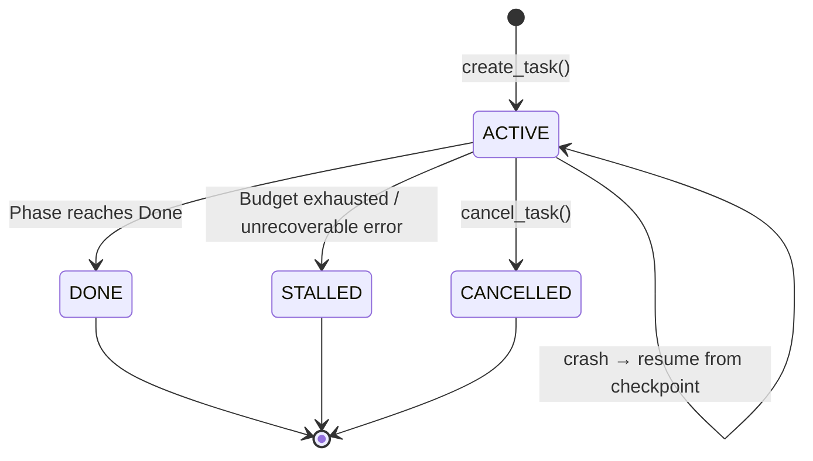
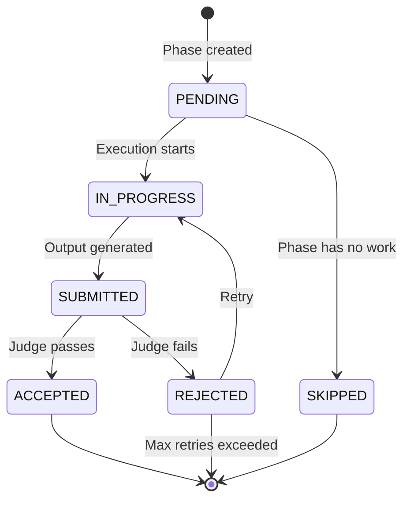
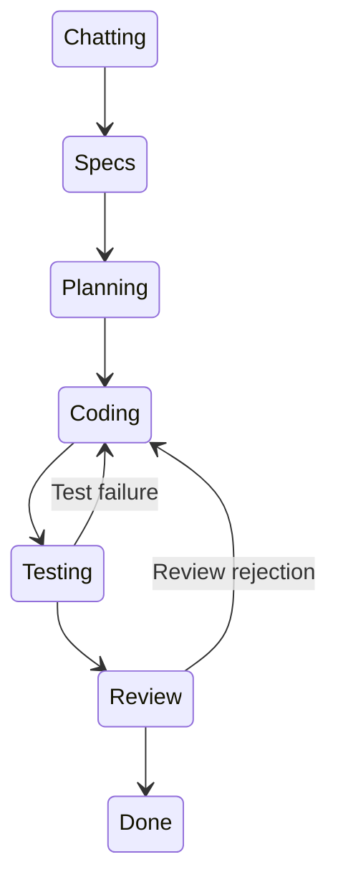
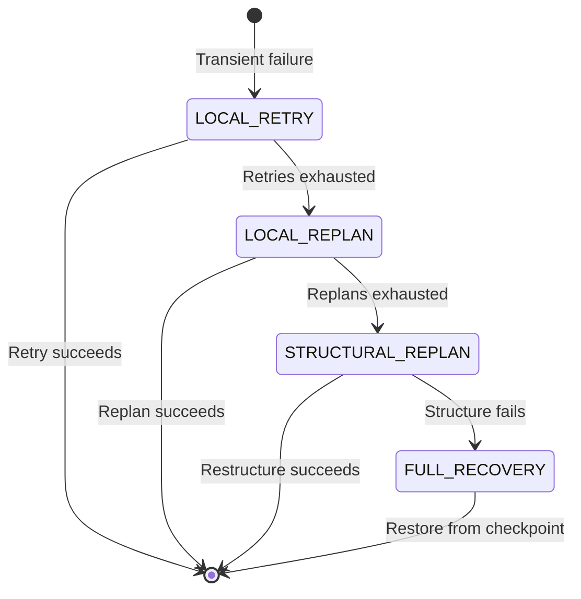

# References

> Glossary, invariants, state machines, data schemas, and exception hierarchy.

---

## Glossary

| Term | Definition |
|---|---|
| **Acervo** | Cross-task memory store using JSONL persistence and tag-based retrieval |
| **Authority** | Centralized governance engine (`OrchestratorAuthority`) that approves all runtime actions |
| **Budget** | Resource ceilings (tokens, time, retries) that are hard limits, not advisory |
| **Checkpoint** | Point-in-time snapshot of task state for crash recovery |
| **Checkpoint Chain** | Ordered sequence of versioned checkpoints for a task |
| **Collapse** | Sycophantic agreement in debate where agents agree without genuine reasoning |
| **Confidence Gate** | Threshold enforcement on approval decisions based on voter confidence |
| **Consensus** | Multi-agent agreement evaluation via LLM judge or majority vote |
| **Context Bundle** | Pre-spec question/answer set produced by the ContextHarvester |
| **Debate** | 3-round multi-agent review protocol for quality evaluation |
| **Decision Record** | Stored rationale for why a decision was made |
| **Drift** | Deviation from planned architecture (layer violations, circular deps) |
| **Engram** | Atomic unit of memory — a tagged, scored knowledge item |
| **Error Memory** | Stored failure with resolution for future pattern matching |
| **Execution Context** | Immutable context for deterministic phase transitions |
| **Execution Policy** | Decision engine for budget, retry, and failure classification |
| **Execution Snapshot** | Determinism snapshot recording graph hash, prompt hashes, model routing |
| **Fail-Fast** | If a gate fails, skip all subsequent gates |
| **Fail-Open** | On error, proceed without the failed check (used for LLM judges) |
| **Fail-Closed** | On error, reject/abort (used for schema checks, budgets) |
| **FSM** | Finite State Machine — the `OrchestratorFSM` that controls phase transitions |
| **Gate** | A validation step (lint, types, tests) in the tool gate sequence |
| **Gate Sequence** | Ordered list of validation gates with fail-fast semantics |
| **Host Agent** | The AI agent (e.g., OpenCode) that calls Foundry's MCP tools |
| **Judge** | LLM-based evaluator that reviews phase output quality |
| **Judge Hierarchy** | Multi-dimension evaluation across 6 judge types |
| **MCP** | Model Context Protocol — the tool protocol used for agent↔server communication |
| **Minority Report** | Dissenting view from a debate agent preserved for the record |
| **Phase** | A stage in the SDLC lifecycle (Chatting, Specs, Planning, Coding, etc.) |
| **Phase Graph** | Directed graph defining legal phases and transitions |
| **Phase Record** | Historical record of a phase execution (status, output, errors) |
| **Prompt Lock** | Content hash of a prompt locked at task creation for determinism |
| **Replay** | Re-execution from a checkpoint version for debugging |
| **Replanning** | Dynamic plan modification preserving stable completed work |
| **Residual Objection** | Concern raised in early debate rounds still present in final round |
| **Restore Point** | Named checkpoint for semantic rollback targets |
| **Rollback** | Reversion to an earlier state preserving stable phases |
| **Schema Check** | Deterministic structural validation (required sections, min content) |
| **Spec Lock** | After spec approval, no human questions allowed; scope changes detected |
| **Stable Phase** | A completed phase marked as protected from rollback |
| **Task** | A user-initiated engineering request tracked through the SDLC lifecycle |
| **Trace** | A collection of related spans for distributed tracing |
| **Span** | A single timed event in a trace |
| **Tool Gate** | Sequential validation gates that must pass before phase advancement |
| **Write Queue** | Async FIFO queue for decoupling tool responses from state writes |

---

## Runtime Invariants

These are the non-negotiable properties that the system must maintain at all times:

### I1: Disk Is Truth
> Persistent state files are canonical. In-memory state is derived from disk state on startup. If in-memory and disk disagree, disk wins.

**Enforced by:** `StateManager` atomic writes; crash recovery reads from disk.

### I2: Validation-First
> Tool gates are authoritative. "Looks correct" is never acceptable when tools can verify.

**Enforced by:** `ToolGate` fail-fast sequence; schema checks run before LLM judge.

### I3: Budget Ceilings Are Absolute
> When a budget ceiling is hit, the task is aborted. No override, no exception, no negotiation.

**Enforced by:** `BudgetController.should_continue()` checked before every phase transition.

### I4: Phase Transitions Are Validated
> The FSM rejects invalid transitions. No phase can be reached without passing through the graph.

**Enforced by:** `PhaseGraph.is_valid_transition()` at construction; `OrchestratorFSM.submit()` at runtime.

### I5: Rollback Never Corrupts Stable Phases
> Completed, stable-marked phases are sacred. Rollback preserves them unconditionally.

**Enforced by:** `RollbackManager.plan_rollback()` safety check; `RollbackManager.validate_rollback()`.

### I6: Checkpoint-Recoverable
> Every phase transition produces a checkpoint. Crashes are recoverable from the last checkpoint.

**Enforced by:** `WriteQueue` writes checkpoint on every accepted submission.

### I7: Single Orchestrator
> One agent (Foundry), internal behavioral modes via prompts. Not a multi-agent swarm.

**Enforced by:** Architecture — no independent agent processes; all reasoning is internal to `engine/`.

### I8: Prompts Are Locked Per Task
> Prompt content hashes are frozen at task creation. The same task always uses the same prompts.

**Enforced by:** `Task.locked_prompts` dict; `JudgeEngine` uses locked prompts when available.

### I9: State Writes Are Atomic
> No state file write can produce a partially-written file.

**Enforced by:** `tmp+rename` pattern in `StateManager`, `EnhancedCheckpointManager`, `Acervo`.

### I10: Authority Is Centralized
> No component may advance phases, retry, replan, or rollback without orchestrator approval.

**Enforced by:** `OrchestratorAuthority.request_authority()` decision point.

---

## State Machines

### Task State Machine



### Phase State Machine



### Phase Graph (Feature Template)



### Recovery Escalation



---

## Data Schemas

### Core Models (from `sdlc/models.py`)

#### Task
```python
class Task(BaseModel):
    task_id: str
    description: str
    mode: str = "feature"
    status: TaskStatus             # active, cancelled, done, stalled
    current_phase: str = "Chatting"
    history: list[PhaseRecord]
    iteration_count: int = 0
    budget: BudgetPolicy
    snapshot: ExecutionSnapshot | None
    locked_prompts: dict[str, str]
    created_at: datetime
    updated_at: datetime
    requires_approval: bool = False
```

#### PhaseRecord
```python
class PhaseRecord(BaseModel):
    phase: str
    status: PhaseStatus            # pending, in_progress, submitted, accepted, rejected, skipped
    output: str | None
    model_used: str | None
    token_estimate: int | None
    duration_ms: int | None
    started_at: datetime | None
    completed_at: datetime | None
    error: str | None
    lineage: list[dict] | None
    iteration_count: int = 0
```

#### BudgetPolicy
```python
class BudgetPolicy(BaseModel):
    max_total_tokens: int = 100_000
    max_review_cycles: int = 8
    max_debate_rounds: int = 3
    max_runtime_minutes: int = 60
    fallback_depth: int = 2
    max_debate_budget_tokens: int = 15_000
    memory_enabled: bool = False
```

#### Checkpoint
```python
class Checkpoint(BaseModel):
    task_id: str
    phase: str
    history: list[PhaseRecord]
    iteration_count: int
    adapter_states: dict[str, Any]
    created_at: datetime
    snapshot: ExecutionSnapshot | None
    debate_active: list[str]
```

#### ExecutionSnapshot
```python
class ExecutionSnapshot(BaseModel):
    snapshot_id: str
    created_at: datetime
    graph_template: str
    graph_hash: str
    prompt_hashes: dict[str, str]
    model_routing_hash: str
    judge_schema_hash: str | None
    adapter_versions: dict[str, str]
    ollama_models: dict[str, str]
```

### Enums

#### TaskStatus
```python
ACTIVE    = "active"
CANCELLED = "cancelled"
DONE      = "done"
STALLED   = "stalled"
```

#### PhaseStatus
```python
PENDING     = "pending"
IN_PROGRESS = "in_progress"
SUBMITTED   = "submitted"
ACCEPTED    = "accepted"
REJECTED    = "rejected"
SKIPPED     = "skipped"
```

#### FailureType
```python
# Retryable
RETRYABLE_MODEL   = "model_timeout"
RETRYABLE_INFRA   = "infra_transient"
RETRYABLE_DEBATE  = "debate_timeout"

# Terminal
TERMINAL_VALIDATION = "validation_failed"
TERMINAL_PHASE      = "phase_mismatch"
TERMINAL_SANDBOX    = "sandbox_violation"
TERMINAL_DEPENDENCY = "dependency_gone"
TERMINAL_CONSENSUS  = "consensus_stalemate"

# Orchestration
ORCHESTRATION_CANCELLED = "cancelled"
ORCHESTRATION_LIMIT     = "limit_reached"
ORCHESTRATION_GATE      = "gate_blocked"
```

#### DecisionAction
```python
PROCEED  = "proceed"
RETRY    = "retry"
ABORT    = "abort"
ESCALATE = "escalate"
```

#### SymbolKind
```python
MODULE     = "module"
CLASS      = "class"
FUNCTION   = "function"
METHOD     = "method"
VARIABLE   = "variable"
CONSTANT   = "constant"
IMPORT     = "import"
INTERFACE  = "interface"
TYPE_ALIAS = "type_alias"
UNKNOWN    = "unknown"
```

#### DebateAgentRole
```python
SPECS     = "specs"
PLANNING  = "planning"
CODING    = "coding"
REVIEW    = "review"
TESTING   = "testing"
CONSENSUS = "consensus"
```

---

## Exception Hierarchy

```
SDLCError (base)
    ├── ConfigError           # Configuration loading/validation
    ├── StoreError            # Persistence layer failures
    ├── PhaseError            # Phase transition/validation errors
    ├── ToolError             # Tool adapter execution errors
    ├── PolicyError           # Execution policy decision errors
    ├── CheckpointError       # Checkpoint save/restore errors
    ├── SandboxError          # Sandbox isolation errors
    ├── DebateError           # Debate runtime/consensus errors
    ├── JudgeError            # Judge evaluation errors
    ├── ModelError            # Model routing/inference errors
    └── CodeGraphError        # Code graph/AST parsing errors
```

All exceptions carry:
- `failure_type: str | None` — maps to `FailureType` enum for retry classification
- `details: dict[str, Any]` — structured context for debugging

### Non-SDLCError Exceptions

| Exception | Module | Purpose |
|---|---|---|
| `OrchestratorError` | `engine/orchestrator.py` | Invalid phase transition (not a subclass of SDLCError) |
| `PhaseGraphError` | `engine/phase_graph.py` | Graph validation failure at startup |
| `SchemaViolationError` | `engine/schema_checks.py` | Output fails structural validation |

---

## File Format Reference

### State Files

| File | Format | Location | Schema |
|---|---|---|---|
| `state.json` | JSON | `data/state/` | `GlobalState` |
| `task_{id}.json` | JSON | `data/state/` | `TaskState` |
| `phase_{id}.json` | JSON | `data/state/` | `PhaseState` |

### Checkpoint Files

| File | Format | Location | Schema |
|---|---|---|---|
| `{id}_chain.json` | JSON | `data/checkpoints/` | `CheckpointChain` |
| `{id}_v{N}.json` | JSON | `data/checkpoints/` | `Checkpoint` + version metadata |

### Trace Files

| File | Format | Location | Schema |
|---|---|---|---|
| `{trace_id}.jsonl` | JSONL | `data/traces/` | `TraceSpan.to_dict()` per line |
| `summaries.jsonl` | JSONL | `data/traces/` | Summary records (append-only) |

### Memory Files

| File | Format | Location | Schema |
|---|---|---|---|
| `engrams.jsonl` | JSONL | `data/memory/` | `Engram.model_dump_json()` per line |

### Configuration Files

| File | Format | Location | Schema |
|---|---|---|---|
| `feature.yaml` | YAML | `configs/graphs/` or `graphs/` | Phase graph definition |
| `model_routing.yaml` | YAML | `configs/` | Model routing config |
| `llm_config.yaml` | YAML | `configs/` | LLM provider config |
| `prompts/*.txt` | Text | `configs/prompts/` | Judge prompt templates |
