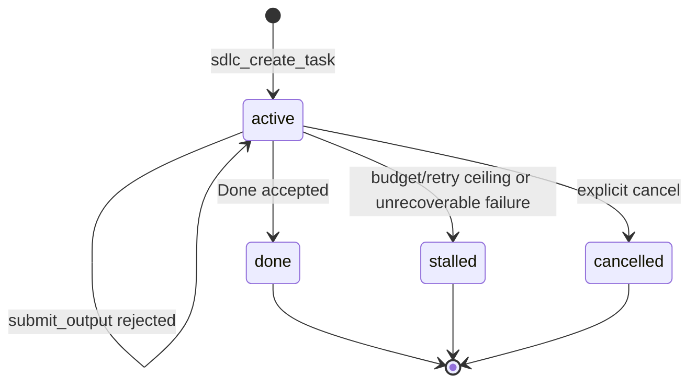
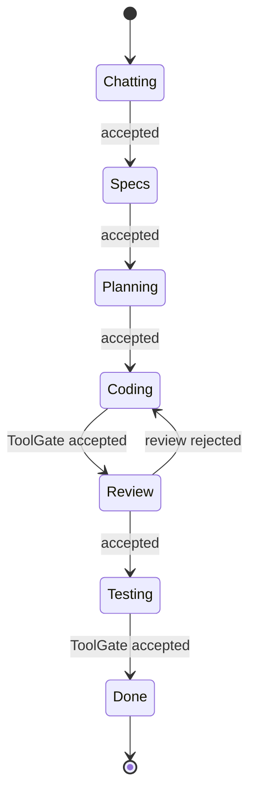
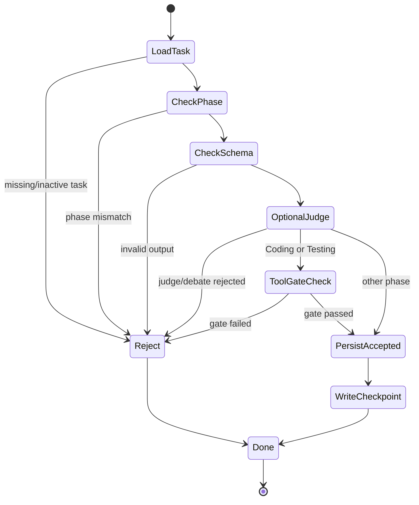
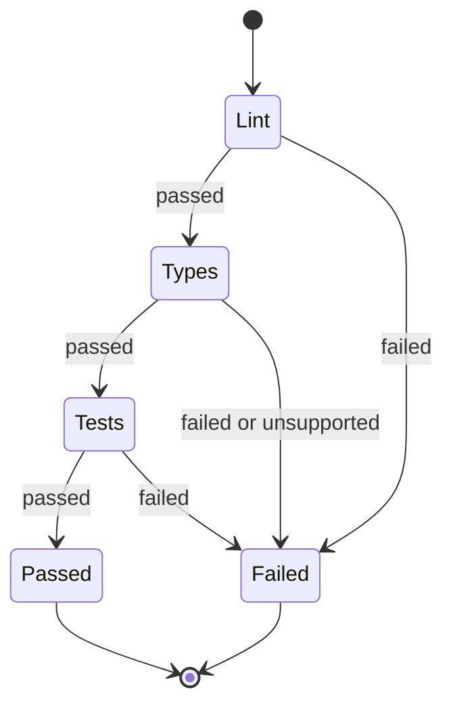
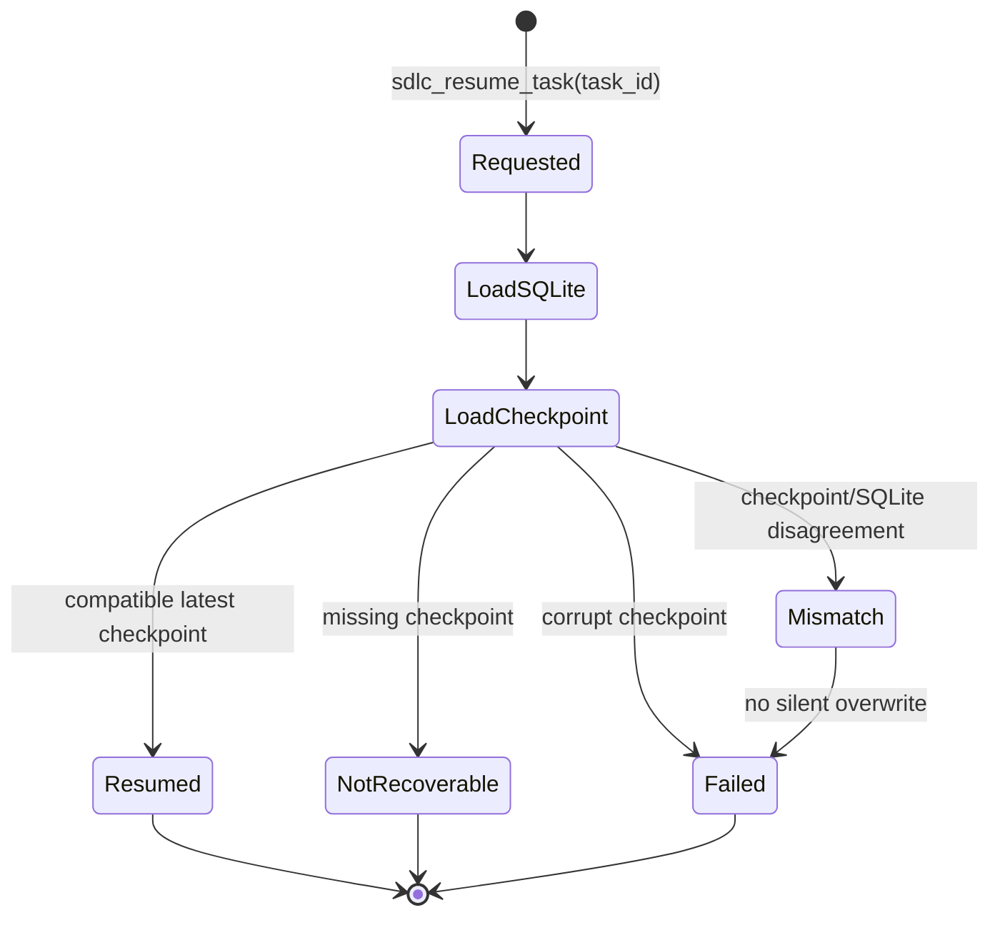
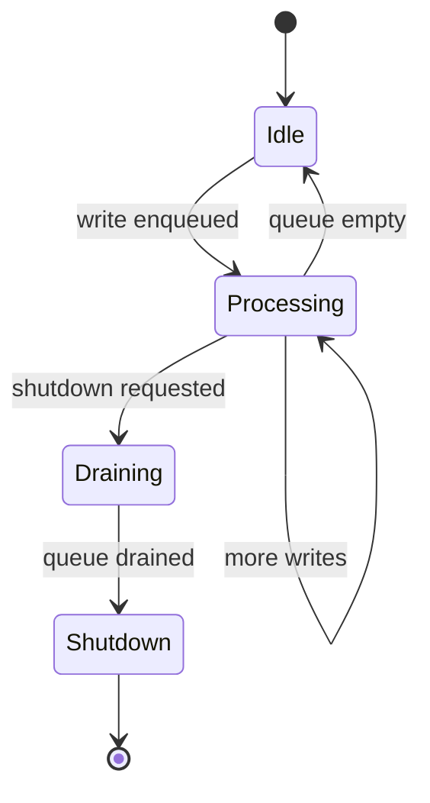

# State Machines

This file is the MVP state-machine reference. It intentionally excludes
post-MVP replay, rollback, multi-workflow, and debate-state diagrams.

## Task Lifecycle

| State | Meaning | Terminal |
|---|---|---|
| `active` | Task can accept submissions for its current phase | No |
| `done` | Feature workflow reached accepted Done | Yes |
| `stalled` | Runtime cannot proceed without user intervention | Yes |
| `cancelled` | User cancelled the task | Yes |

## Feature Phase FSM

MVP supports one workflow:

The source graph may contain `Chatting -> Done`. For MVP this edge is not a
normal feature-task path. It must be disabled for normal feature work or guarded
by an explicit early-completion decision that is persisted and tested.

Other YAML graph templates are not MVP execution paths.

## Submit Pipeline FSM

Rejected attempts may be recorded, but rejected attempts do not advance phase or
write accepted checkpoints.

## ToolGate FSM

The ToolExecutor runs commands. ToolGate evaluates normalized command results.

## Recovery/Resume FSM

MVP recovery restores or confirms the latest accepted state. It does not perform
advanced replay, version-chain selection, git rollback, structural replanning,
or workspace snapshot restoration.

## Write Queue FSM

The write queue preserves accepted-state write ordering. It is not a distributed
queue and does not imply parallel workflow execution.
