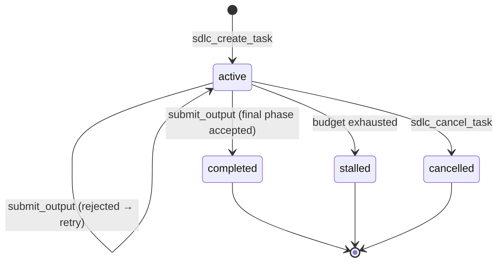
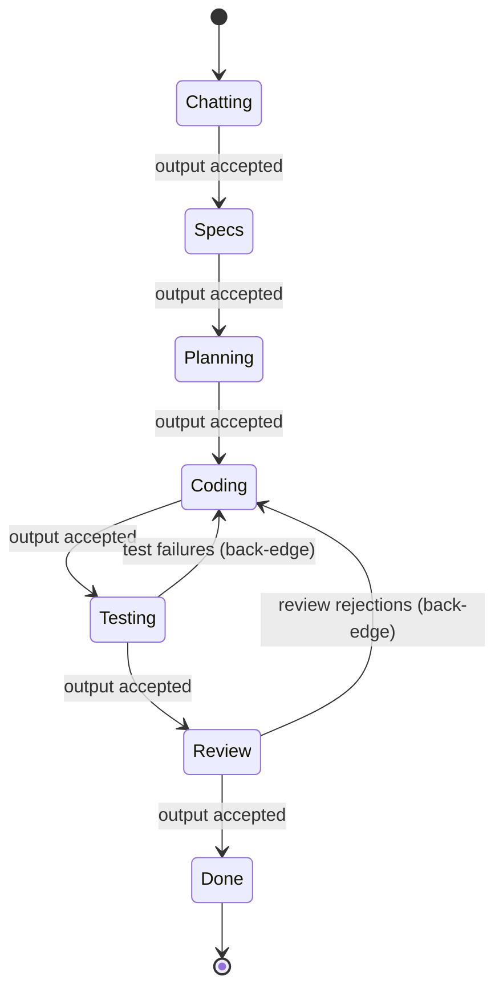
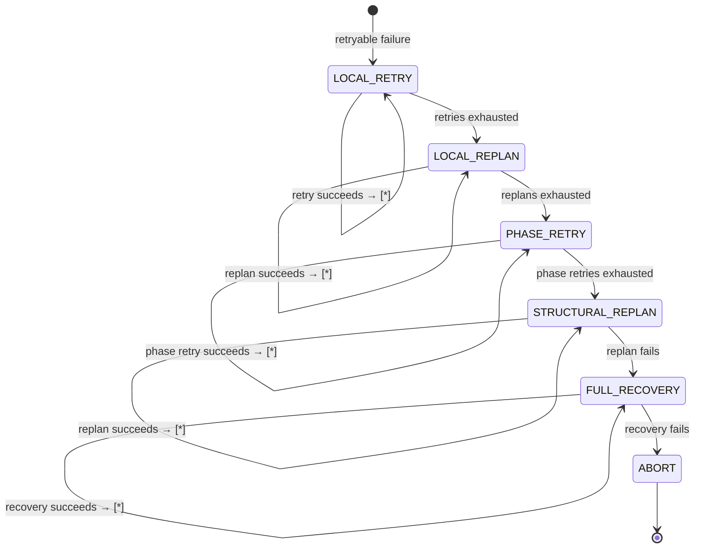
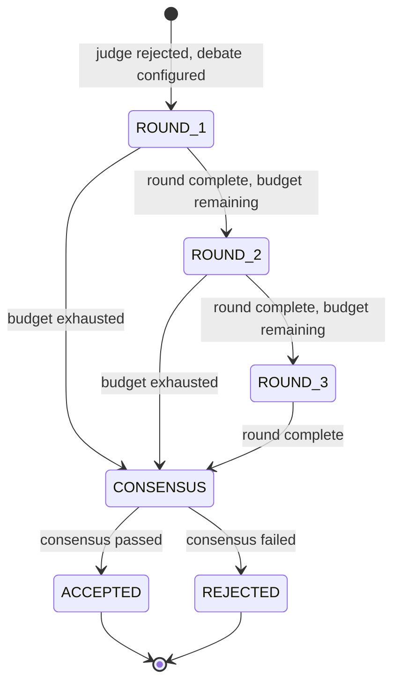
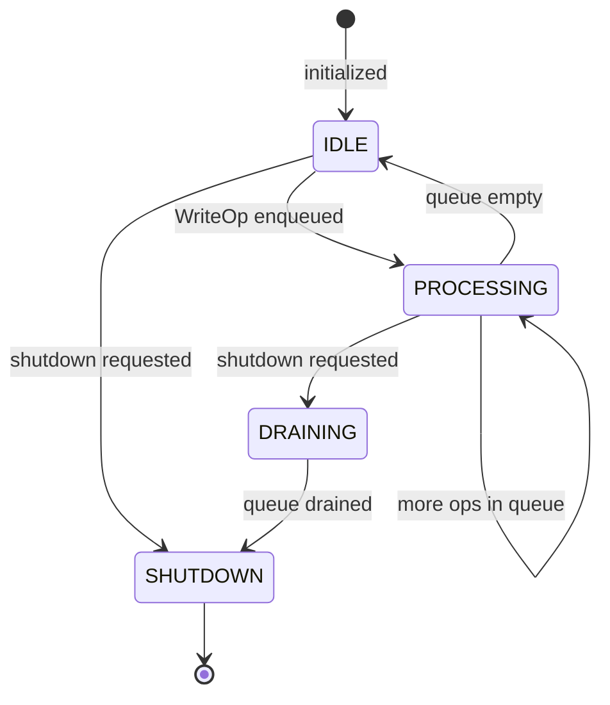

# State Machines

> Mermaid diagrams for all finite state machines in the Foundry runtime.

---

## Task Lifecycle FSM

### States

| State | Meaning | Terminal |
|---|---|---|
| `active` | Task is executing, phases being processed | No |
| `completed` | All phases passed, task reached Done | Yes |
| `stalled` | Budget exhausted or irrecoverable failure | Yes |
| `cancelled` | User explicitly cancelled | Yes |

### Transitions

| From | To | Trigger |
|---|---|---|
| `[init]` | `active` | `sdlc_create_task` |
| `active` | `active` | `submit_output` rejected (stays in same phase) |
| `active` | `completed` | `submit_output` accepted AND next phase is Done |
| `active` | `stalled` | Budget ceiling hit (critical violation) |
| `active` | `cancelled` | `sdlc_cancel_task` |

---

## Phase Transition FSM (Feature Workflow)

### Phase Graph Properties

| Property | Value |
|---|---|
| Entry phase | Chatting |
| Terminal phase | Done |
| Back-edges | Testing→Coding, Review→Coding |
| Minimum path | 7 transitions (no retries) |
| Maximum path | Unbounded (limited by budget) |

### Phase Validation Rules

1. All transitions must be explicitly defined in the graph
2. Every phase must be reachable from the entry phase
3. Done must have no outgoing edges
4. No self-loops (a phase cannot transition to itself)
5. Back-edges must target an earlier phase (not a later one)

---

## Recovery Escalation FSM

### Escalation Counters

| Level | Counter | Default Max | Reset On |
|---|---|---|---|
| LOCAL_RETRY | Per-phase retry count | 3 | Phase reset |
| LOCAL_REPLAN | Per-phase replan count | 2 | Phase reset |
| PHASE_RETRY | Per-phase phase-retry count | 1 | Never (consumed) |
| STRUCTURAL_REPLAN | Per-task replan count | 1 | Never |
| FULL_RECOVERY | Per-task recovery count | 1 | Never |

---

## Debate Protocol FSM

### Round Protocol

| Round | Context Available | Purpose |
|---|---|---|
| ROUND_1 | Phase output only | Independent assessment |
| ROUND_2 | + All Round 1 responses | Deliberation |
| ROUND_3 | + All Round 2 responses | Final positions |
| CONSENSUS | All rounds | Verdict synthesis |

---

## Write Queue FSM

### Queue Guarantees

1. **FIFO ordering** — operations processed in submission order
2. **At-least-once** — operations are retried on handler failure
3. **Graceful shutdown** — DRAINING processes remaining operations before stopping
4. **No loss** — operations in the queue at shutdown are processed
